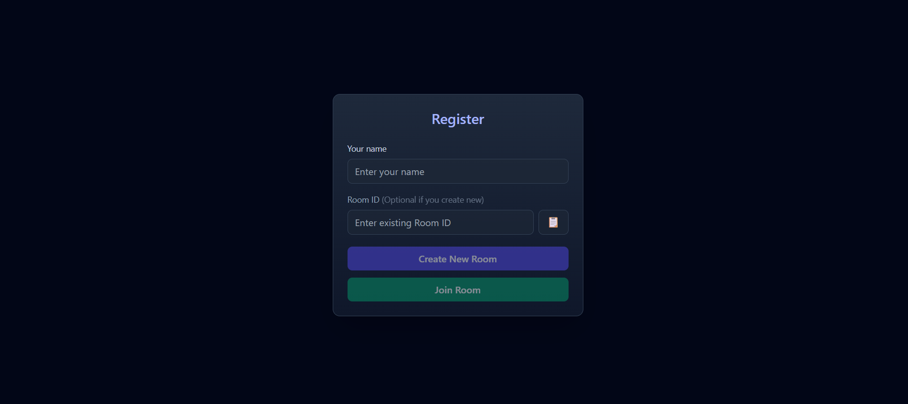
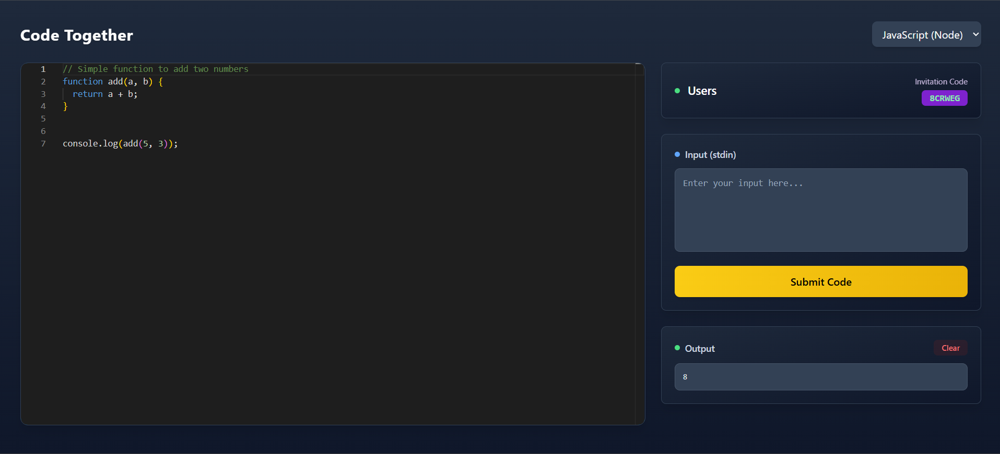

# 🚀 RealCodeLab - Collaborative Real-Time Code Editor  

A modern **real-time collaborative code editor** that enables multiple developers to code together seamlessly.  
Built with cutting-edge technologies for a smooth, conflict-free collaborative coding experience.  

---

## ✨ Features  

### 🤝 Real-Time Collaboration  
- Multi-user editing – code together in real-time  
- Conflict-free synchronization using **Yjs CRDT**  
- Live cursor tracking – see where others are typing  
- Room-based sessions – create or join coding rooms  

### 💻 Professional Code Editor  
- **Monaco Editor** integration – VS Code-like editing experience  
- Syntax highlighting for multiple programming languages  
- Auto-completion and IntelliSense  
- Multiple language support – JavaScript, Python, Java, C++, and more  

### ⚡ Code Execution  
- Live code compilation using **Judge Rapid API**  
- Multi-language support – execute code in various languages  
- Real-time output display  
- Input handling for interactive programs  

---

## 🛠️ Tech Stack  

<p align="center">
  
  
  
  
  
  
  
</p>
---


## 🚀 Live Demo  

🎥 **Video Demo**: [Watch on YouTube](https://www.youtube.com/watch?v=GpBaPiHb2Tc)  

<p align="center">
  
  
</p>

---

## 🔧 Installation & Setup  

### Prerequisites  
- Node.js (v14 or higher)  
- npm or yarn package manager  
- Judge Rapid API key  

### Steps  

```bash
# Clone the repository
git clone https://github.com/symadev/realcodelab.git

# Navigate to frontend directory
cd realcodelab

# Install dependencies
npm install

# Start development server
npm run dev

---

#📜 License

This project is licensed under the MIT License – see the [LICENSE](LICENSE) file for details.

